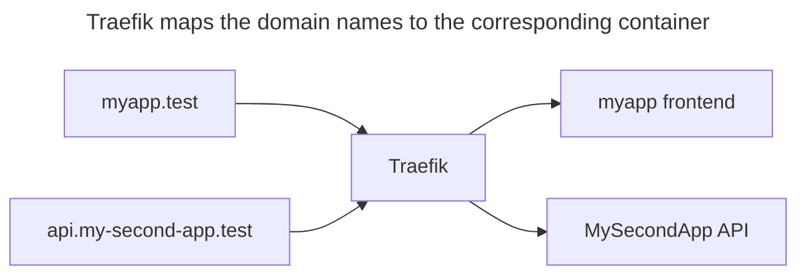
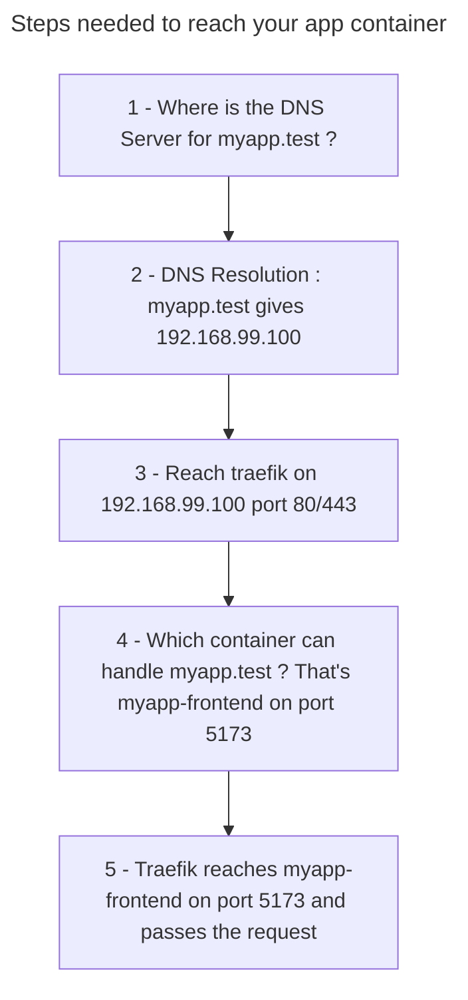

# Configuration with a DNS

This documentation describes how to configure your applications to be accessible through a domain name like `myapp.test` instead of an IP address (like `192.168.99.100`).



Make sure to understand how it works before moving to the configuration section.

NOTE: In this document, the Docker devbox is considered to have the IP address `192.168.99.100`. If you are running on windows, the IP address of windows doesn't matter for the DNS configuration, it's only the WSL/Virtual box IP that matters.
However, in WSL mirrored mode, the boundaries are blurred and any IP address of the windows machine should work.
It's however easier to pick a fixed IP address that we control.

## How it works

When you type "http://myapp.test" in your browser, it will make a query to a DNS server, that will reply with the IP address of the server. The browser will next ask the server at that IP for the page "http://myapp.test".

In our case, that server is Traefik and should be configured so that any request for "myapp.test" should go to the "myapp frontend" container. Traefik then relays the request to your container, and your app can reply.

This can be summarized in the following diagram:



The whole chain needs to work for your application to reply anything. In the following sections, I will detail the steps (beginning with step 5 down to step 1).

I'm trying to make this page as easily understandable as possible. If you don't understand anything, please file an issue :slightly_smiling_face:

Usually, everything works out of the box, except from [Step 2](#step-2--you-can-resolve-the-domain-name) and [Step 1](#step-1--your-browseros-uses-the-dns-server-properly), which need an extra configuration.

## Step 5 : Your app is up and running in your container

To contact your app, your app must be running in your container. Make sure that's the case and that it listens on all network traffic, not only localhost. For example, make sure to use the [`server.host` (vite --host) option in vite.](https://vite.dev/config/server-options.html#server-host)

### Usual causes of failure

- Your app isn't started
- Your app isn't listening on the port you're expecting
- Your app doesn't allow http traffic from anything other than localhost
- You ran your command outside your container (for example: you ran `npm run dev`, but it's not using the `npm` binary from your container)

### How to troubleshoot

If you have curl installed in your container (`node` is the name of my service in the docker-compose.yml), you can try:

```sh
docker compose exec node curl http://localhost:5173
```
If it doesn't return some HTML, your application is not running. If it is running, you might try this command to know if the application is accessible through the network:

```sh
docker compose exec node bash -c "curl http://\$(hostname):51
73"
```

NOTE for vite: This message :
```
Blocked request. This host ("0e5849fa84b2") is not allowed.
To allow this host, add "0e5849fa84b2" to `server.allowedHosts` in vite.config.js.
```
means it works for our use case. If you still have this kind of message (with the domain name), you will need to configure server.allowedHosts.

## Step 4 : Your app is registered within Traefik

With Docker Devbox, we made the decision to use dynamic routing through docker container labels and [traefik's Host matcher](https://doc.traefik.io/traefik/routing/routers/#host-and-hostregexp).

In a docker-compose.yaml file, it may look like this:

```yaml
      traefik.enable: 'true'
      traefik.http.routers.ddb-symfony-vue-demo-tls.rule: Host(`ddb-symfony-vue-demo.test`)
      traefik.http.routers.ddb-symfony-vue-demo-tls.service: ddb-symfony-vue-demo
      traefik.http.routers.ddb-symfony-vue-demo-tls.tls: 'true'
      traefik.http.routers.ddb-symfony-vue-demo.rule: Host(`ddb-symfony-vue-demo.test`)
      traefik.http.routers.ddb-symfony-vue-demo.service: ddb-symfony-vue-demo
      traefik.http.services.ddb-symfony-vue-demo.loadbalancer.server.port: '5173'
```

ddb provides a [`ddb.VirtualHost`](https://inetum-orleans.github.io/docker-devbox-ddb/features/jsonnet/#ddbvirtualhost) to help you write such labels.

```
ddb.VirtualHost('5173', 'ddb-symfony-vue-demo.test')
```

you may also derive the domain name automatically by using the `core.domain.value` ddb variable.

```
local domain = std.extVar('core.domain.value');
```

More info on core.domain values [here](https://inetum-orleans.github.io/docker-devbox-ddb/features/core/)

### Usual causes of failure

- The docker-compose.yml file is not properly configured
- The server port is not configured to the same port than the one your app is listening on
- You made a change to your docker-compose.yml but you forget to re create your containers by running `docker compose down && docker compose up -d`

### How to troubleshoot

Show labels on your containers: ([source](https://gist.github.com/steve-jansen/a90f942e05e326e817aaeb04dff3f4e6?permalink_comment_id=4340723#gistcomment-4340723))
```bash
docker inspect -f '{{ range $k, $v := .Config.Labels -}}
{{ $k }}={{ $v }};
{{ end -}}' ddb-symfony-vue-demo-node-1
```

The traefik container may also have some logs indicating what's wrong:
```
docker logs traefik
```

## Step 3 : You can reach traefik on the IP and port

This might be the easiest one : Traefik needs to be up and listening.

### Usual causes of failure

- Traefik container is not up (go to `~/.docker-devbox/traefik` and `docker compose up -d`)
- You're not contacting the correct IP address
- A firewall is blocking the request

### How to troubleshoot

Open a browser and contact `http://192.168.99.100` (if that's your devbox's IP address). You should see a "404 page not found" message.

If you are on linux and the devbox is installed locally, `http://localhost` should show the traefik dashboard.

If your devbox is on another machine (WSL, virtual machine), run `curl http://localhost/` on that machine to see if traefik is running.

## Step 2 : You can resolve the domain name

Some DNS server need to resolve your request.

Here are a few options:
<details>
<summary>Already own a DNS server, or your company does and is willing to put additional records for that. </summary>

Great, you're probably already using it and don't need to worry about [Step 1](#step-1--your-browseros-uses-the-dns-server-properly) !
</details>
<details>
<summary>You run your coredns server locally.</summary>

CoreDNS can be installed without any administrative privileges, but you might need some to complete the [Step 1](#step-1--your-browseros-uses-the-dns-server-properly).

Here is an example Corefile

```Corefile
.:53 {
    # Resolve *.test to 192.168.99.100
    template IN A test {
      match (^|[.])(?P<subdomain>.*)[.]test[.]$
      answer "{{ .Name }} 60 IN A 192.168.99.100"
    }

    errors
}
```
</details>
<details>
<summary>You are on windows and want something that starts with your OS, try Acrylic DNS.</summary>

Download [Acrylic DNS](https://mayakron.altervista.org/support/acrylic/Home.htm) (the setup). Install it, and edit the hosts file to add this line (adapted with your IP address):

```
192.168.99.100 *.test
```

</details>
<details>
<summary>You are on linux, you can try dnsmasq</summary>

NOTE: this procedure has been ported from a previous version of the documentation and has not been tested since.

- Ubuntu Server (without NetworkManager)

```
sudo apt-get install -y dnsmasq

DOCKER_HOST_IP=$(ip -4 addr show docker0 | grep -Po 'inet \K[\d.]+')
sudo sh -c "echo address=/.test/$DOCKER_HOST_IP>/etc/dnsmasq.d/test-domain-to-docker-host-ip"

sudo service dnsmasq restart
```

- Ubuntu Desktop (with NetworkManager)

NetworkManager from desktop brings it's own dnsmasq daemon.

```
sudo mv /etc/resolv.conf /etc/resolve.conf.bak
sudo ln -s /var/run/NetworkManager/resolv.conf /etc/resolv.conf

sudo sh -c 'cat << EOF > /etc/NetworkManager/conf.d/use-dnsmasq.conf
[main]
dns=dnsmasq
EOF'

sudo sh -c 'cat << EOF > /etc/NetworkManager/dnsmasq.d/test-domain-to-docker-host-ip
address=/.test/$(ip -4 addr show docker0 | grep -Po "inet \K[\d.]+")
EOF'

sudo service NetworkManager restart
```

</details>
<details>
<summary>You cannot/don't want to install anything on your machine, but you can edit your hosts file</summary>

Just add an entry to your hosts file (`/etc/hosts` on linux, `C:\Windows\System32\drivers\etc\hosts` on windows) each time you add a new domain name (no wildcard support like `*.test`). This requires administrative privileges on your OS to do so.

```
192.168.99.100 myapp.test
192.168.99.100 api.my-second-app.test
```
</details>
<details>
<summary>
You cannot touch your machine's configuration, but still want the benefits of a DNS-like name (cookie sharing, https through traefik...)</summary>

You can use a service like `traefik.me`.

For example, if your traefik is at `192.168.99.100`, you can reach your application through `http://myapp.192-168-99-100.traefik.me`.

The only change you need is to configure `core.domain.ext`.

Inside your devbox, create or edit your `~/ddb.local.yaml` with:

```yaml
core:
  domain:
    ext: 192-168-99-100.traefik.me
```

go back to your project and run `ddb configure` again. Go back to [step 4](#step-4--your-app-is-registered-within-traefik) to make sure the whole chain still works. Don't forget to restart your app container.

</details>
<details>
<summary>You give up and bind ports on your machine</summary>

You don't need traefik at all and call your app on something like `http://ip:port`. You need to manage port collision between your app yourself.
</summary>

### Usual causes of failure

- The DNS server used doesn't know the IP address
- The DNS server is not running

### How to troubleshoot

On windows, run this command (127.0.0.1 assumes the DNS is installed locally. Use the DNS server IP instead if not.):

```
nslookup myapp.test 127.0.0.1
```

It should resolve to the IP you set.

On linux, you may use `dig @127.0.0.1 myapp.test +short`

## Step 1 : Your OS uses the DNS server properly

If you used a service like traefik.me or a DNS server that is already configured, you have nothing to do.
Otherwise you need to tell your OS to use your new DNS server.
On linux, it depends on how `/etc/resolv.conf` is managed.
On windows, you need to set the DNS adress as a primary DNS server on one of your *active* network card.

You likely can't pick any card though.
Some network cards are managed by VPN applications, and the DNS address that you may be able to change there will be overwritten the next time you connect.
Some wifi hotspots require that you use the DNS provided by the DHCP to display their captive portal. It's not a good idea to override it there.

If you have installed your devbox with Vagrant, you have a dedicated "Virtualbox Host Only" network card with the IP 192.168.99.1 (by default). You can change the DNS address there because that parameter is not used otherwise.

<details>
<summary>
If you don't have any network card that you can use, you can create a new network card :
</summary>

- Open the Device Management window as administrator. You may open an admin command prompt and type `devmgmt.msc`
- Under "Action", click "Add legacy hardware", "Next"
- "Install the Hardware that I manually select from a list (Advanced)", "Next"
- Choose "Network adapters", "Next"
- From the left list, pick "Microsoft", and on the right "Microsoft KM-TEST Loopback adapter"

Open the network adapter settings and set it a fixed IP address, like 172.0.0.1 (it's not a typo for 127.0.0.1)
</details>

On the properties of the network adapter, set the primary DNS address to the address of your DNS server. If you installed acrylic or coredns locally, you can type `127.0.0.1`.

### Usual causes of failure

- Traefik container is not up (go to `~/.docker-devbox/traefik` and `docker compose up -d`)
- You're not contacting the correct IP address
- A firewall is blocking the request

### How to troubleshoot

Clear dns cache:

```
ipconfig /flushdns
```

Try to ping the dns name:

```
ping myapp.test
```

If the ping command says "Could not find host ...", the configuration doesn't work. Otherwise, the domain name is resolved to the IP address that is shown in the output.